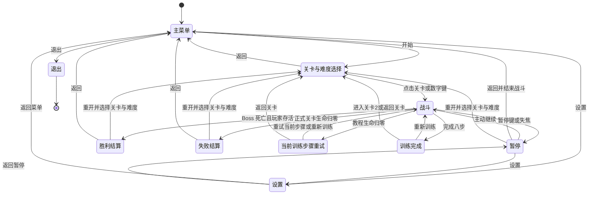
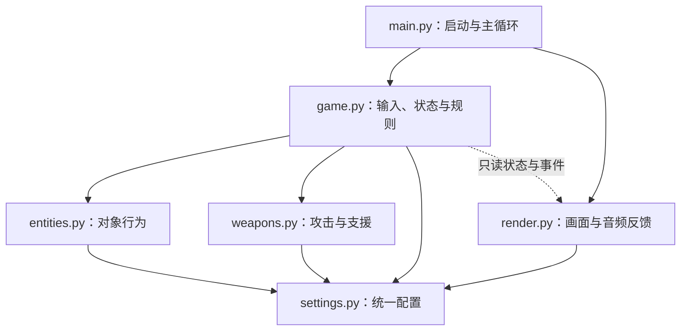

# Alien Invasion 完整开发文档

_版本：1.2 · 更新日期：2026-10-08 · 用途：指导个人项目的实现、整合、测试与交付_

---

本文将 [Game Design.md](Game%20Design.md) 的已确认玩法，与 [Game Development Guide.md](Game%20Development%20Guide.md) 的功能、结构和验收目标整合为一份可执行的开发说明。评分核对使用根目录的 [Marking criteria.pdf](Marking%20criteria.pdf)，原始评分材料与报告模板保持原样。

项目已开始按 P0–P9 实施。实际功能、已执行检查、阶段提交与未完成项目以 [docs/progress.md](docs/progress.md) 为准；下文未登记通过的项目仍属于计划。玩法数值为第一版平衡起点，自动输入运行与人工试玩分开记录。

| 内容性质 | 判断依据 | 使用方式 |
|---|---|---|
| 评分要求 | 原始评分 PDF；指南中的 F01–F05、S01–S08 | 作为证据核对依据，不增加分值或扣分公式 |
| 开发者已确认选择 | 玩法设计第 1–6.11 节 | 按本文规则实现；调整时同步设计文档 |
| 本文补充的实现建议 | 标为“实现建议”“建议默认值”或“拟定接口”的内容 | 可按实际代码调整，不作为新增评分条款 |
| 后续可选扩展 | 本地最高分、更多关卡等 | 首次完整交付不依赖这些功能 |

需求优先级：开发者最新指示优先；玩法以最新设计为准；评分表述以原始 PDF 为准。源码实现、测试记录和运行证据应分别记录，不能用设计完成代替功能完成。

目录：

1. [项目目标与功能范围](#project-scope)
2. [运行环境与工程结构](#environment)
3. [游戏流程、输入与界面](#flow-input-ui)
4. [玩家、武器与战斗资源](#combat)
5. [敌机、关卡与难度](#level-difficulty)
6. [程序结构、数据与接口](#architecture)
7. [美术与声音资源](#assets)
8. [开发实施计划](#implementation)
9. [测试、验收与评分证据](#verification)
10. [交付、维护与参考](#delivery)

<a id="project-scope"></a>

## 🎯 1. 项目目标与功能范围

### 1.1 游戏目标

制作一款 Windows 桌面太空射击游戏。玩家驾驶飞船，以屏幕方向移动、鼠标瞄准、左键持续射击，在陨石与外星敌机的攻击中生存，完成 12 波普通敌群并击毁外星母舰 Boss。

完整版本包含三种难度、三种武器、定时补给、战斗能量和场外支援。标准难度的一局目标时长为 4–6 分钟；这是试玩调优目标，不是已经测得的时长，也不是评分条款。

开发同时追求可玩的完整流程与可解释的代码：对象行为、输入、规则、显示职责清楚；相似对象和武器共用配置、计时与伤害结算；证据能对应具体功能与源码位置。

### 1.2 基础、扩展与可选范围

| 范围 | 已约定内容 | 完成判断 |
|---|---|---|
| 基础版本 | 菜单、说明、难度选择；WASD、鼠标瞄准、基础子弹；生命、碰撞、三种普通敌机、陨石；每 7 秒回血补给；12 波、Boss、结算、暂停、重开、退出 | 可以完成一局胜利或失败，并重新开始 |
| 已选额外组件 | Q 导弹及爆炸、E 连锁电弧；独立三格充能、5 秒武器替换；每 7 秒三种等概率补给；战斗能量、X 场外支援 | 在基础版本之上可使用、可展示、可验证 |
| 后续可选扩展 | 本地最高分、更多关卡、更多敌机、声音与画面进一步打磨 | 单独立项，不阻塞首次完整交付 |

基础版本只生成回血补给，用来验证定时生成、漂移、拾取和生命上限的共用逻辑。加入额外组件后，正式完整版本必须使用回血、导弹、电弧各 1/3 概率的最终规则，不能继续沿用“只掉回血”的阶段性方案。

声音与美术制作按第 7 节执行；“进一步打磨”为可选扩展，不等于取消已确定的资源制作分工。没有开发者提供的 BGM 时，游戏仍应可运行。

### 1.3 项目功能需求清单

以下 G 编号是本文用于开发和测试追踪的编号，不是评分文件条款编号。

| 编号 | 功能要求 | 范围 | 对应验收 |
|---|---|---|---|
| G01 | 按说明启动，显示主菜单，正常退出 | 基础 | M01 |
| G02 | 操作说明、三种难度选择、开始战斗 | 基础 | M01、M09 |
| G03 | WASD 屏幕方向移动、斜向归一化、鼠标朝向 | 基础 | M02、U01 |
| G04 | 按住左键持续开火；释放停止；冷却不能被点击重置 | 基础 | M02、U03 |
| G05 | 生命、圆形碰撞、无敌、位置分离、高速弹丸检测 | 基础 | M03、U01–U02 |
| G06 | 三类普通敌机、路线、分批生成与数量上限 | 基础 | M04、U09 |
| G07 | 陨石预警、生成、移动、摧毁与 Boss 前清场 | 基础 | M03–M04、U09 |
| G08 | 定时补给、拾取、上限和生命周期 | 基础／扩展 | M05、U04 |
| G09 | 12 波、Boss 三阶段、胜负与统计 | 基础 | M04、M08、U10 |
| G10 | 暂停、失焦暂停、重开、回菜单 | 基础 | M07、U11 |
| G11 | 难度参数产生实际行为差异 | 基础 | M09、U12 |
| G12 | Q 导弹、范围爆炸、三格充能、5 秒替换 | 扩展 | M06、U05 |
| G13 | E 首目标扇形与连锁攻击、衰减伤害 | 扩展 | M06、U06 |
| G14 | 有效伤害和击杀产生战斗能量 | 扩展 | M06、U07 |
| G15 | X 五轮场外支援、目标替补、Boss 比例伤害 | 扩展 | M06–M07、U08 |
| G16 | HUD、准星、提示、美术与声音反馈 | 基础／扩展 | M02、M06、M10 |

### 1.4 评分解释边界

原始 PDF 第 1 页明确游戏功能占 50%、程序结构／代码布局占 50%，列出 A 为 70% 以上、B 为 60%、C 为 50%、D 为 40%。没有完整分数区间、逐项分值或固定扣分公式，本文不估算成绩。

游戏功能 A 档明确包含 B 档要求，并关注模块化、复用和规格之外的额外组件；B 档关注启动运行、难度和交互；C、D 档还涉及提供代码及教材资源的运行与中央对象显示。个人独立项目按现有设计开发；若课程另有要求使用教材代码，应取得相应资源并如实记录使用方式，不能声称尚未获得的材料已经满足。中央对象证据应展示外星敌机等对象，不能只用中央玩家位置代替全部显示要求。

指南的 S01–S08 是结构目标整理，不是八项等分评分。模块数量、类数量、注释比例、三种难度、12 波或特殊武器的数量均为项目选择，评分原文没有规定这些具体数量。

<a id="environment"></a>

## 🔧 2. 运行环境与工程结构

### 2.1 已确认技术栈

| 项目 | 要求／方案 | 说明 |
|---|---|---|
| 平台 | Windows 桌面 | 首次交付目标 |
| Python | 3.13.x | 已确认版本系列 |
| 运行依赖 | `pygame==2.6.1` | 已写入 `requirements.txt` |
| 逻辑画面 | 1280 × 720 | HUD 与战斗坐标使用同一逻辑尺寸 |
| 目标帧率 | 60 FPS | 按游戏经过时间更新，不能按帧数决定速度 |
| 计划测试工具 | Python 标准库 `unittest` | 实现建议；当前尚无测试文件 |

首版不需要网络服务、数据库或额外游戏引擎。时间、输入和测试 API 的实施参考见文末官方资料；在线 Pygame 文档标注的版本与项目锁定包版本应区分，最终仍须在 2.6.1 的运行环境验证。

### 2.2 安装、检查与未来启动命令

在项目根目录的 PowerShell 执行已有环境准备命令：

```powershell
py -3.13 -m venv .venv
.\.venv\Scripts\python.exe -m pip install -r requirements.txt
```

使用虚拟环境解释器可避免修改 PowerShell 执行策略。环境建好后，可检查解释器与包版本：

```powershell
.\.venv\Scripts\python.exe --version
.\.venv\Scripts\python.exe -m pip show pygame
```

实现 `main.py` 后的计划启动命令：

```powershell
.\.venv\Scripts\python.exe main.py
```

入口 main.py 和测试工具已建立，安装、启动与实际可用检查命令见 README 和 AGENTS.md；执行结果见 docs/progress.md。

### 2.3 计划目录与文件

下面的树是原始拟定结构。实际实现另有承担生成队列、共用几何和资源职责的 waves.py、geometry.py、resources.py，以及负责关卡 1 教学流程的 tutorial.py；当前文件与验证见 README 及 docs/progress.md，不为满足目录树创建空模块。

```text
Alien Invasion/
├── main.py                         # 初始化、窗口、主循环、退出
├── game.py                         # 状态、输入命令、关卡、碰撞与结算
├── entities.py                     # 玩家、敌机、Boss、陨石、补给
├── weapons.py                      # 弹丸、三种武器、支援与目标选择
├── render.py                       # 对象、HUD、菜单、视觉效果
├── settings.py                     # 基础参数、难度、波次与资源配置
├── assets/
│   ├── images/                     # ships、enemies、items、ui、effects
│   ├── audio/
│   │   ├── sfx/                    # WAV 音效
│   │   └── music/                  # 开发者提供的 BGM
│   └── manifest.md                 # 资源用途、尺寸、来源和状态
├── tests/                          # 建立后存放有价值的规则测试
├── docs/
│   └── evidence/                   # 建立后保存截图、视频索引、验收记录
├── requirements.txt
├── README.md
├── AGENTS.md
├── Game Design.md
├── Game Development Guide.md
├── Development Documentation.md
├── Marking criteria.pdf            # 原始评分材料，保留
└── Project evaluation report.docx  # 原始报告模板，保留
```

原有其他表单继续保留。模块按实际复杂度调整；例如声音加载首版可放在 `render.py` 的资源管理部分，职责明显增加后再提取专门模块，不为评分增加空文件。

<a id="flow-input-ui"></a>

## 👤 3. 游戏流程、输入与界面

### 3.1 游戏状态与转换

顶层状态区分主菜单、关卡与难度选择、设置、战斗、暂停、胜利、失败、教程重试、教程完成和退出。暂停保留当前战斗子阶段，继续时回到该子阶段，不重新初始化关卡。



窗口关闭按钮在任意状态都应正常退出，图中省略各状态到退出的重复连线。最新约定：点击关卡卡片或按 1／2／3 直接进入，Enter 进入当前关卡，Esc 返回主菜单；正式关卡每次开始或重开都可在关卡页选择本局难度。本局开始后冻结所选配置；设置页面不提供难度选项。关卡 2 保留原有 12 波与母舰规则；关卡 3 的普通敌机总量由 118 取整增加为 142，Boss 生命增加 40%；关卡 1 已按确认方案实现八步教程，固定训练难度，末尾两波共 12 架，无 Boss。教程另有 tutorial_retry 和 tutorial_complete 状态：失败可重试当前步骤，完成后可重新训练或返回关卡选择，进入关卡 2 时保留先前所选正式难度。这是开发者后续确认的内容，不改变 baseline-p5 基础范围，也不是新增评分条款。

战斗内部状态单独记录，不与顶层菜单状态混在一个变量里：

| 子阶段 | 进入条件 | 离开条件／保留状态 |
|---|---|---|
| 普通波次 | 开局或波间休息结束 | 队列已全部生成，普通敌机全部死亡或离场 |
| 波间休息 | 第 1–11 波结束 | 经过 3 秒进入下一波；不清敌弹与资源 |
| Boss 前陨石清场 | 第 12 波结束 | 停止陨石生成，等待已有陨石离场或被摧毁 |
| Boss 警告 | 陨石清场完成 | 显示 1.5 秒警告后生成 Boss |
| Boss 入场 | 从顶部中路进入 | 到达 (640,180)；此时才允许攻击和受伤 |
| Boss 战 | Boss 入场完成 | 玩家死亡或 Boss 被击毁，按同帧规则结算 |

普通波间、陨石清场、Boss 警告与入场都属于战斗时间：玩家仍可移动、开火、拾取补给，既有敌弹继续飞行，生命、能量与充能不重置。第 12 波后按清场与警告流程执行，不额外插入一个普通“下一波”。

### 3.2 输入约定

下表列默认键位。设置页以行为／键位两列表格展示，键盘操作可点击单元格重绑定，鼠标瞄准和射击固定；HUD 与暂停提示读取同一键位表。设置、共享键、重置和保存规则见第 6.1 节最新扩展说明。

| 输入 | 生效状态 | 行为 |
|---|---|---|
| WASD | 未暂停的战斗各子阶段 | W 上、A 左、S 下、D 右，与朝向无关 |
| 鼠标移动 | 战斗 | 更新准星；飞船朝向准星 |
| 左键按住 | 战斗区域内且未暂停 | 按当前武器间隔射击 |
| Q | 战斗 | 满三格且没有特殊武器生效时激活导弹 5 秒 |
| E | 战斗 | 满三格且没有特殊武器生效时激活电弧 5 秒 |
| X | 战斗 | 能量满且没有支援时开启支援 |
| Esc | 战斗／暂停 | 暂停／继续 |
| 窗口失焦 | 战斗 | 自动暂停并清除左键按住状态 |
| 菜单按钮／窗口关闭 | 对应界面／任意状态 | 开始、返回、重开或退出 |

Q/E/X 使用按下边沿触发；按住不重复激活，恢复焦点不自动继续。Q/E 失败时不扣充能，X 失败时不扣能量，图标短暂闪烁。Q/E 可以与 X 同时生效，但 Q 与 E 不能同时激活。

实现建议：WASD 的相反方向相互抵消；非零移动向量归一化后乘速度。用原始鼠标位置判断是否位于 HUD，随后才将显示准星限制到战斗区域，避免把 HUD 点击经坐标夹取后误当射击。鼠标停在 HUD 时抑制战斗开火，不改变已有冷却；重新进入战斗区域后按左键持有状态处理。

暂停、失焦和恢复时清理开火锁存与过期激活事件，恢复后必须发生新的左键按下才开火。仍需每帧处理窗口与输入事件，不能用阻塞等待来实现暂停；Pygame 官方事件文档要求持续处理事件队列。[^1]

### 3.3 画面与反馈

逻辑坐标原点位于左上角，x 向右、y 向下。HUD 占 `0 ≤ y < 64`，战斗区为 `0 ≤ x ≤ 1280、64 ≤ y ≤ 720`。玩家半径 14，因此中心范围为 `x=14–1266、y=78–706`，初始中心为 `(640,392)`。

| 界面 | 必须显示的内容 | 操作反馈 |
|---|---|---|
| 主菜单 | 标题、开始、设置、退出入口 | 按钮有可见响应 |
| 关卡与难度 | 三个关卡卡片；简单、标准、困难；返回 | 选中难度有明确标记，点击卡片直接进入，HUD 显示关卡编号 |
| 战斗 HUD | 生命、战斗能量、Q/E 三格、武器与支援剩余时间、波次 | 可用 Q/E/X 高亮；失败激活闪烁 |
| Boss 战 | Boss 生命与阶段提示 | 炮口预警、阶段变化与入场警告清楚 |
| 暂停 | 暂停提示、继续、回菜单 | 背景战斗冻结 |
| 结算 | 胜负、游戏分数、击杀数、用时、重开、回菜单 | 重开建立全新战斗 |

星空向下滚动。飞船图片以向上为原始朝向，渲染时旋转；准星与飞船中心重合时保留上一朝向。鼠标准星为十字，支援锁定标记为方框；补给靠形状与图标区分，不只依靠颜色。

实现建议：首版采用固定 1280 × 720 窗口，先保证逻辑坐标正确；若之后缩放窗口，统一使用等比缩放、留边和反向鼠标坐标映射，不直接把物理窗口坐标写入逻辑世界。中文字体与替代字体由资源清单记录，实际检查中文、数字和符号显示。

### 3.4 胜负、统计与重开

玩家生命 `≤0` 判失败。Boss 生命 `≤0` 且玩家仍存活才判胜利。同一显示帧发生玩家与 Boss 均死亡时，失败优先；伤害事件中不能立即跳转胜利界面，须统一完成该帧结算后判定。

普通敌机击毁分数：侦察机 100、射手机 200、重型机 500；Boss 5000。撞毁普通敌机、玩家武器击杀与支援击杀正常记录游戏分数和击杀数；敌机离场不计击杀、不扣生命。游戏分数与课程评分没有换算关系。陨石分数在原设计中未指定，建议默认 0，也不计入敌机击杀数。

重开创建新战斗状态：生命 100，初始玩家位置；能量、Q/E 充能、分数、击杀数、战斗时间归零；波次从 1 开始；补给从新的第 7 秒开始；所有冷却、无敌、特殊武器、Boss 行为、支援任务和生成队列重置；清除所有旧对象、锁定标记与战斗效果。旧的击杀掉落保底机制已经取消，不创建或恢复相关计数。

胜负、回菜单或退出战斗时终止支援、取消未来攻击、清空能量、停止补给生成、移除未拾取补给。结算用时只统计本局游戏时间，暂停与菜单等待不计入。

<a id="combat"></a>

## ⚙️ 4. 玩家、武器与战斗资源

### 4.1 玩家参数与碰撞规则

| 参数 | 标准基准 | 说明 |
|---|---|---|
| 玩家最大生命 | 100 | 各难度相同 |
| 移动速度 | 340 像素／秒 | 斜向与单方向一致 |
| 普通敌机／Boss 接触伤害 | 20 | 应用难度伤害倍率 |
| 陨石接触伤害 | 25 | 应用难度伤害倍率 |
| 无敌时间 | 0.8 秒 | 受击闪烁，暂停冻结 |
| 接触后推开 | 32 像素 | 远离接触对象，再限制到战斗区 |

采用圆形碰撞，精灵旋转不改变范围：玩家 14、侦察机 16、射手机 22、重型机 30、Boss 60、基础子弹 3、导弹 6、补给拾取范围 14 像素；小／大陨石为 22／36。敌弹半径原设计未指定，建议默认 4 并集中配置，试玩后检查弹幕视觉与碰撞是否一致。

| 相遇对象 | 结果 | 特殊约束 |
|---|---|---|
| 玩家与普通敌机 | 玩家扣血并无敌；该敌机立即摧毁 | 计分、计击杀；非支援期间只有击杀能量奖励 |
| 玩家与 Boss | 玩家扣血并无敌 | Boss 不受接触伤害、不被撞毁 |
| 玩家与陨石 | 玩家扣血并无敌、推开 | 陨石不因接触自动摧毁 |
| 无敌玩家与接触对象 | 位置分离 | 不扣血、不再次撞毁普通敌机 |
| 敌弹先碰陨石 | 敌弹消失 | 不伤害陨石，也不再伤害玩家 |
| 基础子弹与敌机／陨石 | 首个目标受伤，子弹消失 | 不穿透 |
| 导弹与敌机／陨石 | 主目标伤害与范围爆炸 | 主目标不得再次吃溅射伤害 |
| 电弧与敌机 | 按链路伤害 | 不锁定陨石，不被陨石阻挡 |

敌机之间、敌机与陨石之间不结算碰撞伤害；敌弹不伤敌机，玩家弹丸不伤玩家。多个接触对象同时重叠时，第一次有效受击立刻设置无敌，其余只分离，避免一帧连续撞毁编队。

弹丸沿本次移动轨迹寻找最先命中的对象，不能仅检查终点。弹丸中心飞出逻辑屏幕 `0–1280、0–720` 后立即移除；轨迹检测应先裁到有效寿命、射程和屏幕出口，不能命中本应已被回收后的目标。几何算法见第 6.5 节。

### 4.2 武器、目标选择与统一冷却

| 武器 | 整数伤害 | 射击间隔 | 有效范围／运动 |
|---|---|---|---|
| 基础子弹 | 10 | 0.12 秒 | 速度 900 像素／秒，累计射程 900 像素 |
| 追踪导弹 | 主目标 60；其他目标 20 | 0.4 秒 | 速度 420；锁定半径 650；寿命 3 秒；爆炸半径 70 |
| 连锁电弧 | 18、13、10 | 0.2 秒 | 首目标 300；跳跃 130；最多 3 个不同敌机 |

#### 4.2.1 基础子弹与导弹

基础子弹从飞船朝向发射，累计飞行距离达到 900 像素时回收。导弹同样从飞船朝向发射，以导弹当前位置为中心搜寻 650 像素内可受伤敌机，优先选择离鼠标准星最近者。转向速度上限 360 度／秒；原目标死亡、失效或离开锁定范围时重新选择，无目标则沿当前方向飞行并继续搜索。

导弹碰到敌机或陨石都爆炸。主目标承受 60，爆炸范围内其他敌机与陨石各承受 20；同一对象单次爆炸只结算一次，陨石受伤不奖励能量。到寿命、命中或中心出屏立即回收；特殊武器结束不清除已经发射的导弹。

实现建议：爆炸范围采用“爆炸中心到对象中心 ≤ 70＋对象碰撞半径”判断相交；范围内无敌或不可受伤对象承受 0。该相交口径是本文补充，应放入共用几何函数和测试，不能在不同武器中分别解释。

#### 4.2.2 连锁电弧

首目标须在玩家前方总角度 90 度的扇形内，即朝向两侧各 45 度，距离不超过 300 像素；符合者中优先选择离准星最近的敌机。每次跳跃以当前目标为中心，在 130 像素内选择最近且尚未命中的有效敌机，最多命中三架；没有后续目标就结束链路。

第 k 个目标伤害为 `floor(18 × 0.75^(k−1))`，得到 18、13、10；每次都从基础 18 计算，不使用上次取整结果继续衰减。没有首目标时仍消耗本次射击间隔；电弧既不锁定也不伤害陨石，链路不被陨石阻挡。

实现建议：首目标距离、扇形与跳跃距离使用中心距离，边界包含等号；距离相同时按稳定对象 ID 排序，保证测试和表现一致。

#### 4.2.3 激活与冷却

Q/E 各独立储存 0–3 格；满三格且没有特殊武器时，按键消耗对应三格并替换基础武器 5 秒。松开左键不暂停这 5 秒；到期只恢复基础子弹。激活期间可拾取对应补给，为下一次充能，但不能再次激活任一特殊武器。

所有武器共用一个射击时间记录。无冷却时左键首发立即发射；松开、重复点击、激活或到期均不能清除冷却。切换后的下一发同时满足旧冷却与新间隔：

```text
switch_ready_at = max(previous_ready_at, last_shot_at + new_weapon_interval)
每次实际射击：last_shot_at = now；ready_at = now + current_interval
没有上一次射击：可立即首发
未按住左键期间：不积攒、也不补发射击
```

例如，子弹在 0 秒发射后立即切导弹，下一发不早于 0.4 秒；导弹在 0 秒发射后切回子弹，旧 0.4 秒冷却仍保留。电弧空击也更新 `last_shot_at` 与 `ready_at`。

所有有效生命伤害先计算倍率与衰减，再向下取整，有效攻击至少 1；无敌或不可受伤对象为 0。实际扣血为 `min(当前生命, 计算伤害)`，生命不能变成负数。

### 4.3 三种独立战斗资源与补给

| 资源 | 上限 | 获取方式 | 消耗方式 |
|---|---|---|---|
| 生命 | 100 | 回血补给＋25 | 受击 |
| 导弹充能 | 3 格 | 导弹补给＋1 格 | Q 激活扣 3 格 |
| 电弧充能 | 3 格 | 电弧补给＋1 格 | E 激活扣 3 格 |
| 战斗能量 | 100 | 非支援期间有效武器伤害与普通敌机击杀 | X 开启扣 100 |

从进入战斗起，每 7 秒生成一个补给，首次第 7 秒，之后第 14、21 秒等；每次独立选择回血、导弹、电弧，各 1/3。满血或某武器满充能不改变生成概率，敌机、Boss、陨石的击毁均不触发掉落，也没有连续未掉落保底。

补给从战斗区域顶部生成，x 在 48–1232 随机选择，不直接生成在玩家身上；速度 45 像素／秒向下，寿命 10 秒，离场或超时移除。满血不消耗回血补给，满充能不消耗对应补给；对象继续漂移，后来有空间可再拾取。建议生成位置若与玩家重叠，重新选择有效位置，确保仍只生成一个。

计时贯穿普通波次、3 秒休息、陨石清场、Boss 警告、入场与 Boss 战，不在换波重置；暂停冻结，重开从 0 重新计算，结束战斗停止。每次计划时刻只生成一份，不能因一帧多次更新重复创建。

### 4.4 战斗能量结算

战斗能量不自动衰减，满能量在未使用时保留。支援未开启时，三种玩家武器对敌机每造成 1 点实际整数生命伤害获得 0.1 能量。普通敌机击杀额外奖励：侦察机 2、射手机 4、重型机 8；Boss 击杀奖励 0。普通敌机伤害奖励与击杀奖励可叠加。

例：一枚导弹击毁剩余 20 生命的侦察机，只按 20 点实际扣血获得 2 能量，再获击杀奖励 2，共 4；不能按 60 点标称伤害计算。撞毁侦察机在非支援期间只有 2 点击杀奖励，没有武器伤害奖励。

过量伤害、命中无敌对象、攻击陨石均不回能。支援期间所有来源都不回能，包括玩家武器、撞毁、支援以及任何击杀，能量始终为 0；计分、击杀、回血和武器补给仍正常处理。是否回能按事件发生时的支援状态判断，不能以当前画面中弹丸的发射时刻决定。

实现建议：内部使用 0–1000 的整数“十分之一能量单位”，1 点实际伤害增加 1 单位，2／4／8 能量奖励增加 20／40／80 单位；HUD 显示 `units // 10`。这样保留 0.1 精度，也避免浮点误差导致满条不能激活。

### 4.5 X 场外火力支援

战斗能量达到 100 且没有支援时，X 消耗满条并立即开始。没有敌机也能开启，不退款。完整支援持续 7.5 秒游戏时间，每 1.5 秒开始一轮，共 5 轮：

| 轮次 | 相对开始时间 | 锁定／飞行表现 | 预期伤害时刻 |
|---|---|---|---|
| 1 | 0 秒 | 约 0.4 秒收紧标记＋0.25 秒场外飞入 | 约 0.65 秒 |
| 2 | 1.5 秒 | 同上 | 约 2.15 秒 |
| 3 | 3 秒 | 同上 | 约 3.65 秒 |
| 4 | 4.5 秒 | 同上 | 约 5.15 秒 |
| 5 | 6 秒 | 同上 | 约 6.65 秒 |
| 结束 | 7.5 秒 | 清理支援状态并再次清空能量 | 不生成第 6 轮 |

每轮从画面内存活且可受伤敌机中，按距准星由近到远选择最多 3 个不同目标；不足 3 个只锁现有目标。同一轮不能重复锁定或命中同一敌机，Boss 占一个名额，后续轮次可以再锁。最多 15 次目标打击不代表 15 架不同敌机。

无目标轮次照常计数，不延期、不补发、不退款。锁定过程中目标死亡或离开画面，打击前优先补锁有效替补；替补也必须避开本轮其他名额，没有替补就取消该名额。实现建议：在 0.4 秒锁定完成、发出场外攻击前执行补锁；攻击飞行后目标再次失效则取消伤害，避免对不存在的对象结算。

支援命中普通敌机直接摧毁；Boss 每次受到 `floor(max_hp × 0.10)`，可以被该伤害击杀。三难度每次分别为 192／240／300；五轮都命中只移除满血 Boss 的 50%。场外飞行只是表现，伤害按锁定目标结算，不被陨石阻挡。

支援过程中 X 无法再次开启，Q/E 不受支援限制。支援期间和结束时战斗能量保持／清为 0；到期后恢复常态回能。暂停冻结轮次、锁定、飞行与结束时间；胜负、返回菜单或退出战斗提前发生时，取消剩余轮次和攻击、清空能量。只有没有提前结束的完整支援才必须执行五轮。

<a id="level-difficulty"></a>

## 📊 5. 敌机、关卡与难度

### 5.1 普通敌机参数与路线

以下为标准难度基础参数；移动、生命、敌弹及射击间隔按第 5.5 节倍率计算。

| 类型 | 生命／圆半径 | 基础行为 | 攻击 |
|---|---|---|---|
| 侦察机 | 20／16 | 180 像素／秒，直线、斜线或摆动穿场 | 不射击 |
| 射手机 | 50／22 | 110 像素／秒，到 y=180 后横移 8 秒，再向下离场 | 每 1.5 秒一发，速度 250，伤害 10 |
| 重型机 | 120／30 | 70 像素／秒，到 y=150 后停留 10 秒，再向下离场 | 每 2 秒三发扇形，速度 200，伤害 15 |
| Boss | 2400／60 | 入场速度 100，战斗横移速度 120 | 敌弹速度基准 240，伤害 15 |

普通敌机只在画面内、满足入场至少 0.5 秒的条件后开火；入场、停留和离场期间可受伤。8 秒／10 秒停留时长和 0.5 秒入场保护性等待不随难度缩放。

| 路线／入口 | 具体规则 |
|---|---|
| 直线侦察机 | 始终向下，不折返 |
| 斜线侦察机 | 向下偏左／右 25 度，方向固定 |
| 摆动侦察机 | 入场 x 左右各 70 像素、周期 2 秒；纵向持续前进 |
| 射手机横移 | x=120–1160 边界折返；8 秒后向下离场 |
| 重型机停留 | 停留中心左右各 60 像素摆动、周期 4 秒；10 秒后向下离场 |
| 重型机扇形弹 | 以开火时玩家方向为中心，总角 40 度，相邻 20 度，三发同时发出 |
| 顶部六路 | x=160、352、544、736、928、1120 |
| 顶部三路 | x=320、640、960 |
| 中路双列／左右双列 | x=480、800／x=240、1040 |
| 顶部生成中心 | y=64−自身半径 |
| 左右侧面生成中心 | x=−自身半径／1280＋自身半径，y=110 |

侧面侦察机斜向对侧下方飞行；侧面射手和重型机先进入战斗区域，再前往各自停留位置。普通敌机出屏离场后回收，不重新飞回，也不要求玩家必须击杀，避免波次无限等待。

实现建议：为顶部／侧面入场对象保留 `entering` 标记，不能仅因出生时在屏幕外立即回收；记录进入战斗区域后再按离场条件清理。“画面内且可攻击／可锁定”统一采用对象中心在战斗矩形内的口径，渲染可显示边缘部分进入的对象。重型机摆动周期固定，移动速度倍率用于入场／离场等速度参数，不同时改变已指定的摆动周期。

### 5.2 12 波配置与推进

同一正式关卡的波次组成在三难度保持相同。下表为关卡 2 的原始配置；关卡 3 的增量配置见本节末尾。关卡 1 使用独立教学脚本及两波训练配置，不使用该 12 波表。

| 波次 | 侦察／射手／重型（总数） | 基础生成间隔 | 入口与路线 |
|---|---|---|---|
| 1 | 8／0／0（8） | 0.90 秒 | 中路双列，直线下降 |
| 2 | 7／1／0（8） | 0.90 秒 | 左右双列交替，斜向内侧 |
| 3 | 6／2／0（8） | 0.85 秒 | 顶部六路左至右，摆动 |
| 4 | 6／2／1（9） | 0.85 秒 | 三路交错，中路重型机 |
| 5 | 5／3／1（9） | 0.80 秒 | 顶部六路，内侧斜飞与射手横移 |
| 6 | 5／3／2（10） | 0.80 秒 | 左右双列，重型停留两侧 |
| 7 | 4／4／2（10） | 0.75 秒 | 三路交错，侦察摆动、射手折返 |
| 8 | 4／4／2（10） | 0.75 秒 | 顶部六路右至左，中路压制 |
| 9 | 5／4／2（11） | 0.70 秒 | 顶部六路，直线与摆动交替 |
| 10 | 4／4／3（11） | 0.65 秒 | 左右侧面交替，侦察斜飞对侧 |
| 11 | 4／5／3（12） | 0.60 秒 | 顶部六路，射手交错、侦察摆动 |
| 12 | 4／4／4（12） | 0.60 秒 | 顶部六路混合，重型分散 |

每波第一架立即生成，其后按配置间隔生成。类型交错、入口轮换，各类型按剩余数量递减；场内名额包含已生成但未离场的普通敌机，入场对象也占用名额。到达难度上限时暂缓，不丢弃队列，也不在空位出现后一口气补齐所有逾期敌机。

实现建议：按侦察→射手→重型循环挑选仍有余量的类型，再分配当前入口；满上限时保留当前待生成项，允许有空位后生成一架，再从本次实际生成时刻安排后续间隔。这里没有另行定义生成间隔难度倍率，三难度沿用表中间隔，通过上限和敌方行为体现差异。

所有计划对象已生成且场内普通敌机为空才结束该波。第 1–11 波休息 3 秒，期间战斗仍更新；第 12 波结束转入陨石清场与 Boss 警告。初始配置总计 62 架侦察、36 架射手、20 架重型，共 118 架普通敌机；离场会使实际击杀数低于生成数。

2026-10-08 关卡 3 调整：118 × 1.2 = 141.6，按整数总量取 142（增加约 20.34%），按原机型比例分配为 75／43／24。数量增量分散到现有 12 波，间隔、入口、路线和难度场内上限沿用上表。配置集中在 `settings.LEVEL_CONFIGS`，每局和换波读取选定关卡配置。

| 波次 | 关卡 3 侦察／射手／重型（总数） |
|---|---|
| 1 | 10／0／0（10） |
| 2 | 8／1／0（9） |
| 3 | 7／2／0（9） |
| 4 | 7／2／1（10） |
| 5 | 6／3／1（10） |
| 6 | 6／4／2（12） |
| 7 | 5／5／2（12） |
| 8 | 5／5／2（12） |
| 9 | 6／5／3（14） |
| 10 | 5／5／4（14） |
| 11 | 5／6／4（15） |
| 12 | 5／5／5（15） |

关卡 3 Boss 基础生命为 3360（2400 × 1.4），应用原难度生命倍率后，简单／标准／困难为 2688／3360／4200。阶段仍以最大生命的 2/3 与 1/3 判断，支援仍扣最大生命的 10% 并向下取整，即每轮 268／336／420；简单难度五轮共扣 1340，符合原整数伤害规则。后续 Boss 数值表和历史阶段验收中的 2400／1920／3000 均为原始基线，不代表关卡 3。

2026-10-08 关卡 1 教程实现：前七步为移动说明、子弹射击与松开、三次实际躲避、回血拾取、Q 导弹直接命中、E 三目标连锁、真实充能后的五轮支援；第八步复用 WaveController 生成 `(6,0,0,1.2)` 与 `(3,2,1,1.4)` 两波，场内上限 2，休息 3 秒，第二波开始每 8 秒尝试投放单颗小陨石。完整规则与界面见 [教程说明](docs/level-1-tutorial-design.md)。实际伤害、拾取、充能、技能计时和支援复用共用规则，安全来自不攻击的训练靶机、指定补给与当前步骤检查点。训练预设和重试写入日志；公开输入检查工具不写入生命、充能、能量或完成进度。

### 5.3 Boss 阶段与攻击调度

Boss 从顶部中路进入 `(640,180)`；入场期间不攻击、不受伤。到达后中心在 `x=320–960、y=180` 往返，基础速度 120 像素／秒，应用难度移动倍率。Boss 最大生命也应用难度倍率。

| 阶段 | 生命比例／标准生命 | 轮次间隔 | 弹幕 |
|---|---|---|---|
| 第一阶段 | 大于 2/3／大于 1600 | 1.4 秒 | 5 发扇形，向下中心，总角 60 度，相邻 15 度 |
| 第二阶段 | 1/3–2/3，含边界／800–1600 | 1.1 秒 | 3 发瞄准连射 |
| 第三阶段 | 小于 1/3／小于 800 | 0.9 秒 | 7 发扇形与 3 发瞄准连射交替；首先扇形 |

七发扇形总角 90 度，相邻 15 度。瞄准连射三发内部间隔固定 0.05 秒，每发分别瞄准发射当时的玩家位置，发出后直线飞行，不追踪。轮次间隔指相邻轮第一发之间的时间；每轮第一发前 0.6 秒显示炮口预警。

阶段改变立即取消正在执行和排队的 Boss AI：移动、炮口预警、尚未发射的连射；随后进入 1 秒过渡，Boss 不移动、不攻击，但仍可受伤。其他对象和已发敌弹继续活动，不清弹。

过渡中受到新伤害不延长截止时间；到期按当前生命选最终阶段，重新建立移动与攻击计时。单次伤害跨多个阈值只进入最终对应阶段，不补演被跳过阶段。实现建议：到达战斗位置或过渡结束后，将第一轮安排在 `now＋当前阶段间隔`，预警安排在第一轮前 0.6 秒，避免延续旧阶段任务。

Boss 轮次间隔应用难度射击间隔倍率；0.05 秒内部间隔、0.6 秒预警和 1 秒过渡保持既定值。Boss 入场不可受伤时不能被导弹锁定、电弧或支援选中；过渡可受伤，可再次被锁定。Boss 接触只伤玩家，不摧毁或伤害 Boss。

### 5.4 陨石生成与清场

| 参数 | 标准基准 | 规则 |
|---|---|---|
| 小陨石 | 半径 22、生命 40 | 由子弹／导弹摧毁 |
| 大陨石 | 半径 36、生命 80 | 同上 |
| 生成 | 每 4 秒、上限 3 | 按难度调整间隔与上限 |
| 纵向速度 | 100–140 像素／秒 | 向下 |
| 横向速度 | −35 至 35 像素／秒 | 缓慢旋转 |
| 入场预警 | 0.6 秒 | 顶部对应位置提前显示 |
| 接触伤害 | 25 | 应用难度伤害倍率 |

不直接在玩家身上生成；摧毁无战斗能量、无补给。陨石生命与漂移速度没有指定难度倍率，按现有设计保持不变；难度主要改变生成压力与对玩家伤害。

实现建议：小／大陨石各 1/2 随机，入场 x 取不越过左右边界的范围；第一次实际入场位于所选难度的一个生成间隔后，预警提前 0.6 秒。预警预约也计入生成名额，达到上限不累计补发；第 12 波结束同时取消尚未入场的预警预约，确保清场后不会再出现新陨石。这些补充需通过试玩和测试确认。

已有陨石在 Boss 前继续移动，可以被玩家摧毁；全部离场／摧毁后再执行 1.5 秒 Boss 警告。Boss 战期间不恢复陨石生成；敌弹、补给和玩家状态不因清场切换而重置。

### 5.5 三种难度与计算结果

| 参数 | 简单 | 标准 | 困难 |
|---|---:|---:|---:|
| 敌机生命倍率 | 0.8 | 1.0 | 1.25 |
| 敌机移动速度倍率 | 0.8 | 1.0 | 1.2 |
| 敌弹速度倍率 | 0.75 | 1.0 | 1.25 |
| 敌机射击间隔倍率 | 1.3 | 1.0 | 0.8 |
| 敌弹与接触伤害倍率 | 0.75 | 1.0 | 1.2 |
| 普通敌机场内上限 | 3 | 5 | 8 |
| 陨石生成间隔 | 16/3 秒≈5.33 | 4 秒 | 8/3 秒≈2.67 |
| 陨石场内上限 | 2 | 3 | 4 |

敌机生命与有效伤害统一 `max(1, floor(基础值×倍率))`。间隔倍率越小，开火越频繁；不将倍率错误地乘到开火次数上。

| 可直接对照的结果 | 简单 | 标准 | 困难 |
|---|---:|---:|---:|
| 侦察／射手／重型生命 | 16／40／96 | 20／50／120 | 25／62／150 |
| Boss 最大生命 | 1920 | 2400 | 3000 |
| 射手移动速度 | 88 | 110 | 132 |
| 射手敌弹速度 | 187.5 | 250 | 312.5 |
| 射手射击间隔 | 1.95 秒 | 1.5 秒 | 1.2 秒 |
| 射手敌弹伤害 | 7 | 10 | 12 |
| 重型／Boss 敌弹伤害 | 11 | 15 | 18 |
| 普通敌机／Boss 接触伤害 | 15 | 20 | 24 |
| 陨石接触伤害 | 18 | 25 | 30 |
| 单次支援 Boss 伤害 | 192 | 240 | 300 |

玩家生命与速度、三武器伤害、特殊武器 5 秒、三格要求、补给 7 秒／1/3 概率／回血 25、无敌 0.8 秒，以及支援 7.5 秒／1.5 秒／五轮／每轮三目标／Boss 10% 比例均保持相同。Boss 连射内部间隔与阶段过渡不缩放；普通敌机停留时间和固定路线周期保持设计值。

难度验收要同时对照配置与实际画面：简单更慢、更疏，困难更快、更密、更痛。数值表正确只能证明配置一致，不能证明实际手感已经达标。

<a id="architecture"></a>

## 🔗 6. 程序结构、数据与接口

### 6.1 模块职责与依赖方向

采用单进程、单主循环。`game.py` 负责协调规则，实体保存自己的状态，武器执行攻击行为，渲染读取状态并绘制。配置由 `settings.py` 统一提供，禁止各对象各自复制一套难度数值。

实际新增 `tutorial.py`：TutorialController 仅在关卡 1 管理步骤、脚本目标／补给、检查点和操作结果判定，调用共用实体、武器及波次接口；game.py 将实际拾取、击毁、技能与支援结果通知它。模块不反向导入 Game，render.py 只读取教学状态。步骤过渡使用可暂停的 UI 计时冻结战斗 0.8 秒，清除上一阶段攻击与输入；暂停、失焦和设置冻结技能及教程进度。关卡 2／3 不创建教程控制器。



图中实线表示调用／配置依赖，虚线表示提供绘制状态和反馈事件。`entities.py` 与 `weapons.py` 不导入 `game.py`；通过参数接收必要数据或返回事件，避免循环导入。若类型标注形成循环依赖，使用只用于类型检查的引用或小型公共数据定义，不传入整个控制器来绕过职责划分。

| 模块 | 输入 | 输出／负责的状态 |
|---|---|---|
| `main.py` | 窗口事件、帧经过时间 | 创建游戏与渲染器；组织一帧；正常释放 Pygame |
| `game.py` | 标准化输入、游戏时间 | 顶层与关卡状态；对象集合；伤害、计分、胜负 |
| `entities.py` | `dt`、目标位置、对象配置 | 位置、速度、生命、行为阶段；行为请求 |
| `weapons.py` | 按键请求、准星、候选目标、时间 | 冷却、弹丸、电弧链路、支援任务与攻击请求 |
| `render.py` | 只读世界视图、效果／声音事件 | 菜单、HUD、精灵、提示；缓存和播放资源 |
| `localization.py` | 语言 ID、文本键与格式化参数 | 英语／简体中文界面文本；默认语言为英语 |
| `preferences.py` | 本地设置文件、语言／音量／键位偏好 | 字段校验、保存、默认键位、重置与冲突集合；难度不属于偏好 |
| `settings.py` | 固定基础值与所选难度 | 生效配置；波次、武器、敌机与资源参数 |

统一伤害与击杀结算由 `game.py` 的规则函数执行，武器不能自行修改总分或能量。移动相似的敌机通过配置与行为类型复用；不要求每种敌机都建立子类。对复杂 Boss／支援使用小型控制器，有明确状态即可。

2026-10-08 设置扩展：正式入口加载 `Preferences`，首次默认英语；键位、语言与音量保存到程序目录的 `user_settings.json`，开始、重开、回菜单及下次启动均沿用。语言仅在设置页手动选择，移除全局 F1 和其他页面的切换入口。设置页不包含难度，每局在关卡页选择难度，中途不可修改。

`InputState` 与 `Game` 共用偏好中的键位字典；`control_rows()` 的行为／键位两列同时提供绘制和命中范围。捕获状态优先处理下一个键盘键，Esc、Enter、F1 与修饰键都可绑定，点击其他位置取消等待。冲突键位不交换或阻止，所有对应动作均收到输入，仍受既有充能、互斥和暂停规则约束。显示层用独立 `ui_time` 在冻结战斗时仍生成四秒一轮的低不透明度红色提示。

滑块通过同一范围计算并限制 0–100% 音量，拖动时即时更新，松开、失焦、返回或退出时保存。设置页仅提供“重置键位”，只原地恢复默认键位，保留语言和音量。保存使用临时文件替换，读取缺失／损坏字段回退默认值，保存失败保留本次偏好并显示提醒。规则测试见 `tests/test_settings.py`／`tests/test_language.py`，真实窗口检查见 `tools/check_settings.py`／`tools/check_language.py`，证据见 `docs/acceptance.md`。

### 6.2 数据归属与关键不变量

| 数据／建议名称 | 归属 | 必须保持的约束 |
|---|---|---|
| `GameSession` | `game.py` | 每次开局全新创建；难度配置本局固定 |
| `InputState` | 输入处理 | 连续移动与左键持有分开；Q/E/X 为单次命令 |
| `Player` | `entities.py` | 生命 0–100；中心不越过玩家边界；朝向非零 |
| `Enemy`／`Boss` | `entities.py` | 稳定 ID；`hp` 整数；仅一次死亡结算 |
| `Projectile` | `weapons.py` | 保存旧／新位置、来源、伤害、寿命与射程 |
| `Pickup`／`Meteor` | `entities.py` | 唯一 ID、位置、尺寸、生成与到期时间 |
| `WeaponController` | `weapons.py` | 一个活动武器；Q/E 各 0–3；共用射击冷却 |
| `SupportController` | `weapons.py` | 轮索引 0–5；每轮目标去重；活动时能量 0 |
| `WaveController` | `game.py` | 队列不丢；上限只计普通敌机；完成条件明确 |
| `BossController` | `entities.py` 或专用规则段 | 入场不可伤；过渡可伤；行为任务可取消 |
| 游戏统计 | `GameSession` | 分数、击杀、用时只记录本局，结算后冻结 |

对象集合分别管理敌机、陨石、玩家弹丸、敌弹、补给和视觉效果。更新时标记删除，帧末统一清理；不在正迭代的列表内直接删除导致漏更新。死亡标记与统计结算标记要区分，保证多弹命中同一目标不重复计分。

实现建议：支援任务保存稳定目标 ID 与本轮已分配／已命中 ID 集合，而不是只保存易过期对象引用；暂停保存状态，不复制世界。效果采用单独寿命，不让爆炸动画继续参与伤害碰撞。

### 6.3 拟定内部接口

以下名称用于落实职责，可在实现中调整；接口存在与正确性仍待开发验证。

| 接口 | 输入与返回 | 约束 |
|---|---|---|
| `Game.start_session(difficulty_id)` | 创建全新 `GameSession` | 不复用上局队列与冷却 |
| `Game.handle_events(events)` | 更新持有状态、返回一次性命令 | 任意状态处理退出；失焦暂停 |
| `Game.update(dt, commands)` | 执行本次战斗更新 | 暂停不推进游戏时间 |
| `Entity.update(dt, context)` | 更新自身行为，返回射击等请求 | 不修改全局统计 |
| `WeaponController.try_activate(kind, now)` | 返回成功／失败 | 失败不消耗；保留冷却 |
| `WeaponController.try_fire(now, aim, targets)` | 返回弹丸／电弧攻击请求 | 需要左键，遵守当前冷却 |
| `apply_damage(target, amount, source)` | 返回实际扣血和首次死亡信息 | 检查可受伤性；统一整数化 |
| `finalize_kill(target, source)` | 更新分数、击杀和可用能量奖励 | 每个目标仅调用一次有效结算 |
| `select_targets(origin, aim, candidates, rule)` | 返回稳定有序 ID 列表 | 筛选范围、可受伤性与去重 |
| `SupportController.start(now)`／`update(now)` | 创建／推进有限五轮任务 | 与战斗结束、暂停协调 |
| `WaveController.update(now, active_count)` | 返回本次可生成对象 | 满上限延迟；不补发队列 |
| `Renderer.draw(surface, view)` | 绘制当前只读视图 | 不改变生命、计时或分数 |

伤害来源至少区分基础子弹、导弹直接／溅射、电弧、支援、接触和敌弹；同一来源标识用于能量规则与验收日志。摧毁普通敌机的支援／接触可使用专门 `destroy_enemy` 入口，仍调用统一死亡结算，不能绕过“一次计分”。

### 6.4 主循环、时间与事件顺序

Pygame 的 `Clock.tick` 返回帧经过的毫秒，可用于限帧和取得 `dt`；项目另维护只在战斗更新时增长的游戏时间，以保证暂停同步冻结。[^2]

建议主循环流程：

1. 取得本帧经过时间，读取并处理全部窗口／输入事件。
2. 先处理暂停、失焦、返回与退出；若本帧进入暂停，不执行战斗更新。
3. 未暂停时推进游戏时间；处理到期状态、激活命令、生成、移动、攻击与碰撞。
4. 完成本帧伤害、死亡统计与 Boss 阶段变化；清理失效对象。
5. 统一判定失败，再判定胜利，最后绘制 HUD、对象与反馈。

暂停仍执行第 1、2、5 步；不得增长补给、支援、武器、无敌、波间、Boss 预警、连射、过渡或对象寿命计时。恢复后只使用恢复后的新帧时间，不能把整个暂停长度加入 `dt`。

实现建议：运动采用小步更新，单步不大于 1/60 秒；保留正常帧的全部经过时间，不靠截断时间来悄悄改变一局时长。较长卡顿将剩余时间分步处理，并在计划事件截止时刻拆分更新，依时间顺序执行，避免一次更新同时错误补发多轮攻击。长时间失焦由暂停机制处理。

同一时间戳建议采用固定顺序：到期状态（含支援结束／武器恢复）→激活命令（X 先于当时伤害）→生成／射击→运动碰撞及伤害→统计／Boss 阶段→帧末胜负。支援半开区间为 `[start,start＋7.5)`，在结束时先清能量，再允许同一时刻后续常态伤害回能；这属于本文明确的边界实现方案，需写入测试。

同帧胜负优先级覆盖所有内部小步：本帧 Boss 被击毁后保留待结算结果，既有攻击仍可能使玩家在本帧死亡，最终统一判失败；此时不再安排下一关卡或新的 Boss AI。

计时使用截止时间与序号，而不是“倒计时小于零就不断触发”。补给使用 `next_drop_at=7,14,21…`；支援使用相对于开始的五个固定轮次时刻及轮索引，明确拒绝第 6 轮；Boss 连射任务可整体取消。建议内部使用整数微秒或等价精度，避免 0.1／1.5 等浮点边界误判。

### 6.5 共用算法与异常处理

#### 6.5.1 高速弹丸的最早碰撞

把对象的碰撞半径与弹丸半径相加，检测弹丸旧中心到新中心的线段与目标圆是否相交。对移动目标，使用双方旧、新位置构造相对运动线段，求最早相交的 `t∈[0,1]`；所有候选中选最小 t，同一 t 用稳定 ID 打破平局。

敌弹只比较玩家与陨石，若陨石更早命中则吸收敌弹。基础子弹比较敌机与陨石；导弹在首次命中点结算主目标与爆炸。先按有效寿命、射程与屏幕出口截取本次飞行，保留命中点用于效果表现。初始重叠视为 t=0，零长度线段退回圆形重叠检测。

#### 6.5.2 朝向、推开与目标选择

准星与玩家重合时不归一化零向量，保留上次朝向；接触对象中心重合时，推开方向使用上次非零接触方向或固定安全方向，避免除零。推开后再限制玩家边界；无敌期间只执行位置分离。

导弹、电弧与支援共用“存活、可受伤、范围、稳定排序”的筛选基础，各自传入不同规则。Boss 入场状态与过渡状态的可受伤性由同一接口提供，不能在每个武器中复制三套阶段判断。

#### 6.5.3 配置、资源与错误处理

难度生效值从基础配置构造新配置，不修改全局基础值，否则连续重开可能把倍率重复叠加。启动检查波次组成、参数正值和必要资源；缺少必要资源给出可理解的文件名与路径错误，不把空白画面当正常启动。

资源使用程序目录解析，例如 `Path(__file__).resolve().parent / "assets"`；路径与当前工作目录分离，避免只能从某一终端目录启动。资源加载、字体选择和旋转缓存由显示层负责。无 BGM／音频设备时可采用静音降级，仍保证游戏流程可验证；开发阶段的几何占位图应明确标识，交付前替换或如实记录。

调试日志只记录阶段、生成、激活、伤害／击杀、轮次和结算等关键事件；开发检查可注入时间与随机源，正式玩法不依赖测试脚本或作弊开关。

<a id="assets"></a>

## 📦 7. 美术与声音资源

### 7.1 制作分工与图像清单

美术、图标及其他非代码资源由助手生成，音效由助手设计，BGM 由开发者提供。下表保留初始资源制作计划；已整合的图集、实际尺寸、声音与来源见 assets/manifest.md。

| 资源组 | 初始规格 | 格式／用途 | 当前状态 |
|---|---|---|---|
| 玩家飞船 | 64 × 64 | 透明 PNG，原始朝向向上 | 待制作 |
| 侦察机 | 48 × 48 | 同上 | 待制作 |
| 射手机 | 64 × 64 | 同上 | 待制作 |
| 重型机 | 96 × 96 | 同上 | 待制作 |
| Boss | 256 × 160 | 母舰精灵，碰撞圆半径仍为 60 | 待制作 |
| 小／大陨石 | 64 × 64／96 × 96 | 透明 PNG，旋转不改变碰撞范围 | 待制作 |
| 回血／导弹／电弧补给 | 各 48 × 48 | 三种可辨形状与图标 | 待制作 |
| Q／E／X 图标 | 各 48 × 48 | 充能与可用性反馈 | 待制作 |
| 鼠标准星／支援锁定框 | 尺寸按 UI 调整 | 十字／方框，清楚区分 | 待制作 |
| 星空、弹丸、尾焰、爆炸、电弧 | 适配逻辑画面 | 保持与飞船一致的视觉风格 | 待制作 |

图像按职责存入 `assets/images/`，音效存入 `assets/audio/sfx/`，音乐存入 `assets/audio/music/`。建议资源清单包含相对路径、用途、尺寸／时长、格式、来源、制作日期、许可／使用说明、是否为占位资源和验收状态；对生成资源如实注明生成方式。

### 7.2 音效与 BGM

| 音效 | 目标时长 | 听感与触发 |
|---|---|---|
| 基础子弹 | 约 0.05 秒 | 短促脉冲，实际发射触发 |
| 导弹发射 | 约 0.18 秒 | 低频发射声 |
| 导弹爆炸 | 约 0.35 秒 | 命中爆炸触发 |
| 电弧 | 约 0.12 秒 | 电流噪声，限制连续叠加 |
| 补给拾取 | 约 0.15 秒 | 上行提示，仅实际拾取触发 |
| 玩家受击 | 约 0.15 秒 | 冲击声，无敌期间不重复触发 |
| 支援锁定 | 约 0.10 秒 | 锁定提示 |
| 场外支援打击 | 约 0.4 秒 | 呼啸与爆炸 |
| Boss 阶段切换 | 约 0.5 秒 | 警示声，每次过渡一次 |

音效默认 44.1 kHz、16 位 WAV；制作时控制峰值避免失真，限制同类同时播放数量。高频射击可用预生成的轻微音高变化版本；电弧连续攻击不应叠成过响噪声。音效和音乐音量独立设置，具体 UI 与默认音量属于实现细节。

BGM 不由助手代选。开发者提供文件后，记录来源与使用许可，再确定循环点和音量；没有音乐文件照常运行，不阻塞基础功能验收。

### 7.3 资源验收

逐项检查透明边缘、原始朝向、缩放与旋转后的清晰度；碰撞提示不因精灵尺寸造成误导。检查敌弹、玩家弹丸、补给、HUD 与支援效果同时出现时仍能识别；大面积爆炸不应遮挡关键弹幕或准星。

运行时检查资源路径、中文字体、音频设备与静音情况；频繁射击、支援三目标命中和 Boss 过渡时不失真、不重复播放错误事件。资源验收必须实际运行，不以文件存在或图像生成成功代替。

<a id="implementation"></a>

## ✍️ 8. 开发实施计划

### 8.1 里程碑与完成条件

开发分为 P0–P9 共 10 个阶段。P0 准备需求；P1–P5 完成基础版本；P6–P7 加入已选额外组件；P8 制作并整合最终资源；P9 完成整体验收与交付。阶段是项目执行安排，不是评分原文规定的阶段或分值，也不代表工期承诺。

| 阶段 | 要实现的功能／工作 | 可验收成果 | 进入下一阶段的条件 |
|---|---|---|---|
| P0 需求与工程基线 | 固定范围、操作、数值、模块与验证方法 | 一致的需求和实施清单 | 基础／扩展边界明确，规则可追踪 |
| P1 启动、画面与基础输入 | 入口、窗口、星空、玩家／敌机显示、WASD 与朝向、退出 | 可启动、可操作的最小程序 | 实际通过启动、显示、输入、退出检查 |
| P2 基础射击与生存规则 | 基础子弹、生命、碰撞、无敌、暂停、失焦 | 可射击、受伤和暂停的战斗场景 | 基础攻击和时间／碰撞规则正确 |
| P3 普通敌群与场景资源 | 三类普通敌机、12 波、陨石、7 秒回血补给 | 可运行完整普通关卡 | 波次与对象生命周期正确，无无限等待 |
| P4 Boss 与完整关卡 | Boss 入场、三阶段、胜负、统计、内部重开 | 标准难度完整关卡 | 真实胜利／失败和同帧优先级验收通过 |
| P5 菜单、难度与基础验收 | 主菜单、说明、三难度、暂停菜单、重开／返回 | 完整基础版本 | 基础范围全部通过验收，难度有实际差异 |
| P6 特殊武器与三种补给 | Q/E、三格、5 秒、导弹爆炸、电弧、随机补给 | 特殊武器扩展版本 | 新规则通过测试，基础操作与关卡回归正常 |
| P7 战斗能量与场外支援 | 有效伤害回能、X 五轮、替补、Boss 10%、清理 | 完整玩法版本 | 支援所有边界通过，其他资源与统计不受破坏 |
| P8 最终美术与声音 | 图片、图标、效果、音效、字体与 BGM 接口 | 使用最终资源的游戏版本 | 资源显示／声音验收通过，缺 BGM 仍能运行 |
| P9 整体回归与交付 | 全流程、平衡、可复现运行、文档、演示证据 | 完整交付包与验收记录 | 第 9.5 节发布门槛全部满足 |

每阶段遵守同一通过规则：本阶段必需功能已经实现；对应验收项全部满足；受影响的既有功能没有回归；保存实际结果与证据。未实现、测试失败或无法运行的必需项，不得标为通过或关闭阶段。可提前准备后续资源，但下一阶段的正式整合应建立在上一阶段通过的版本上。

阶段测试引用第 9 节的 U／M 编号。早期只执行已实现功能的子场景，记录具体子场景；例如 P2 的 U03 仅检验基础子弹冷却，Q/E 切换部分留到 P6，不能提前把整组 U03 标为通过。最终 P9 才核对完整版本的全部适用场景。

P1 起始版本须有真实输入响应，不能只显示静态窗口。P1–P7 可以使用明确标识的临时几何图形，P8 完成最终资源替换。模块化、配置复用、相对路径和关键规则注释从 P1 开始落实，不集中留到交付前补做。

### 8.2 每阶段功能与验收清单

#### 8.2.1 P0：需求与工程基线

进入条件：已取得两份源文档和现有项目材料。本阶段不实现游戏代码。

要完成的工作：

- 记录基础版本、已选额外组件和后续可选功能的范围
- 确定操作、胜负、12 波、Boss、三难度、武器、补给与支援规则
- 记录 Python 3.13.x、Pygame 2.6.1、模块职责、资源分工和计划运行方法
- 建立 G 功能需求到 U／M 验收项的追踪，标明本文建议与已确认玩法的区别

验收标准：

- [ ] 设计与本文没有相互冲突的核心规则；特殊武器 5 秒、补给 7 秒、支援五轮等数值一致
- [ ] 基础版本先用回血补给，正式扩展版本改为三种等概率补给，阶段差异已写明
- [ ] 每个必需功能都能找到实现说明和验收方式；未规定细节有明确建议标记
- [ ] 评分要求、开发建议和开发者选择区分清楚，没有新增评分公式或功能数量要求
- [ ] 当前实现与验证状态如实记录，没有把计划命令或测试写成已通过

交付证据：需求文档版本、范围表、规则对照和未决实现事项。以上文档检查完成后进入 P1；文档通过不等于运行通过。

#### 8.2.2 P1：启动、画面与基础输入

进入条件：P0 文档基线核对完成。

要实现的功能：

- 建立 `main.py`、Pygame 初始化、主循环与正常释放资源
- 显示 1280 × 720 窗口、64 像素 HUD 占位、滚动星空、玩家和外星敌机占位图形
- 玩家出生于 `(640,392)`；实现 WASD 屏幕方向移动、鼠标准星与朝向
- 支持关闭窗口退出；资源路径从程序目录解析
- 将安装和真实启动命令同步到 README

验收标准：

- [ ] 按 README 在目标环境启动，实际解释器与 Pygame 版本符合约定，窗口没有初始化错误
- [ ] 玩家和敌机图形可见；留下包含中央对象显示的画面，不能只有空窗口
- [ ] WASD 能改变位置，转动飞船后移动方向仍按屏幕；斜向移动不比单向快
- [ ] 玩家不越过战斗区域边界；准星在战斗区域内；准星重合时朝向不抖动
- [ ] 星空持续滚动且窗口可响应；操作后关闭窗口能正常结束程序，没有残留进程
- [ ] 从不同工作目录调用入口仍能解析所需资源，不依赖本机写死路径

交付证据：启动日志、对象截图、移动与瞄准短视频、退出结果。对应 M01 的启动／显示／退出子项、M02 的移动／朝向子项和 U01 的移动子项；菜单与战斗伤害尚不在本阶段验收。

#### 8.2.3 P2：基础射击与生存规则

进入条件：P1 可以启动、操作并正常退出。

要实现的功能：

- 左键基础子弹：伤害 10、间隔 0.12 秒、速度 900、射程 900
- 生命 100、圆形碰撞、实际整数扣血、0.8 秒无敌闪烁和 32 像素接触推开
- 普通敌机接触撞毁、陨石接触伤害、敌弹被陨石阻挡和最早轨迹命中
- Esc 暂停、失焦自动暂停、恢复后重新按左键；HUD 生命反馈
- 使用标准难度的少量测试对象验证规则，建立适合独立验证的规则测试工具

验收标准：

- [ ] 无冷却时按下左键立即发射，按住以 0.12 秒间隔持续射击；释放停止，连点不能加速
- [ ] 子弹只命中轨迹上的第一个有效对象，射程到期或中心出屏回收，高速移动不穿过小目标
- [ ] 玩家接触普通敌机扣 20 且撞毁敌机，接触陨石扣 25；无敌期不重复扣血或连续撞毁
- [ ] 接触后推开并限制边界，中心重合不产生除零／非法位置；生命和 HUD 显示一致
- [ ] 敌弹先碰陨石时消失且不伤陨石／玩家，不能再沿原轨迹结算玩家伤害
- [ ] 暂停冻结移动、射击、碰撞、无敌和已存在对象寿命；失焦自动暂停，恢复不自动开火
- [ ] U01–U03、U11 中本阶段子场景有实际结果；实际检查 M02、M03、M07 中已实现操作

交付证据：战斗场景、受击／暂停录像和规则测试结果。测试工具建立后，将真实可执行命令登记到 README 与 AGENTS.md。Boss 接触例外和特殊武器冷却分别在 P4／P6 补验。

#### 8.2.4 P3：普通敌群与场景资源

进入条件：P2 的射击、生存、暂停与碰撞规则通过。

要实现的功能：

- 三类普通敌机的生命、路线、入场等待、瞄准／扇形射击、停留与离场
- 第 5.2 节全部 12 波配置，标准难度普通敌机上限 5，生成队列和 3 秒波间休息
- 大小陨石、0.6 秒预警、标准 4 秒生成间隔与上限 3
- 每 7 秒一份回血补给，回血 25、漂移 45、寿命 10 秒、满血不消耗
- 普通敌机分数与击杀数；波间保留敌弹和玩家状态，第 12 波结束停止陨石并清场

验收标准：

- [ ] 每波组成、入口和生成间隔与配置一致，全部 12 波共生成 118 架普通敌机
- [ ] 第一架立即生成；标准场内普通敌机不超过 5，入场对象占名额，满额不丢队列或批量补发
- [ ] 射手横移停留 8 秒、重型停留 10 秒后正常离场；只在画面内且入场至少 0.5 秒后射击
- [ ] 队列全部生成且场内敌机清空后才推进；即使敌机未被击杀而离场，也能完成全部波次
- [ ] 第 1–11 波结束休息 3 秒，玩家可操作，既有敌弹继续飞行，生命与统计不被重置
- [ ] 陨石入场前有 0.6 秒提示，实际生成不超过上限；摧毁陨石不生成补给
- [ ] 第 7、14、21 秒各只掉一份回血；跨波不重置；满血接触不消耗；暂停冻结计时
- [ ] 第 12 波结束取消未来陨石生成／预约；已有陨石自然离场或被摧毁后进入 Boss 前准备
- [ ] U04、U09 的基础子场景和 M04、M05 的普通关卡子项通过；基础操作、伤害与暂停回归正常

交付证据：12 波生成／结束记录、陨石预警与补给计时记录、普通关卡运行录像。本阶段在 Boss 前准备处结束验收，不把完成普通波次标为整局胜利。

#### 8.2.5 P4：Boss 与完整关卡

进入条件：P3 能完成全部普通波次和陨石清场。

要实现的功能：

- 清场后 1.5 秒 Boss 警告；Boss 顶部中路入场，到 `(640,180)` 后进入战斗
- 标准生命 2400、横移、三阶段弹幕、0.6 秒炮口预警与 0.05 秒内部连射间隔
- 阶段切换中断 AI、1 秒过渡、跨阈值选择、既有敌弹保留
- Boss 碰撞例外、失败优先、胜负统计与结束清理
- 提供战斗重开入口并初始化新局，为下一阶段菜单整合复用

验收标准：

- [ ] 陨石未清空不开始 Boss 警告；警告 1.5 秒后入场；Boss 入场不攻击也不受伤
- [ ] Boss 到位后在 x=320–960 往返，标准阶段一／二／三间隔为 1.4／1.1／0.9 秒，弹幕数量与角度正确
- [ ] 标准生命 >1600 为阶段一、800–1600（含边界）为阶段二、<800 为阶段三；第三阶段先扇形再交替
- [ ] 连射每发瞄准当时玩家位置；阶段改变立即取消移动、预警与未发连射，已经发出的敌弹继续飞行
- [ ] 过渡持续 1 秒且仍可受伤，新伤害不续时；多阈值跨越不补演阶段
- [ ] 接触 Boss 只伤玩家，Boss 不被撞毁或扣接触伤害；同帧双方死亡在不同事件遍历顺序下都判失败
- [ ] 标准难度至少真实完成一次胜利、一次失败；分数、击杀数、用时正确，未使用无敌或跳波替代通关
- [ ] 重开恢复生命 100，清除旧对象、统计、冷却、波次与补给计时；第一次新补给仍在新局第 7 秒
- [ ] U10 和已实现的 U11、M08 子项通过；Boss 战仍持续定时回血，暂停与基础射击正常

交付证据：Boss 各阶段录像、标准完整胜负记录、同帧失败规则测试、重开状态记录。本阶段可通过开发用开始／重开入口验收关卡，正式菜单与三难度由 P5 完成。

#### 8.2.6 P5：菜单、难度与基础版本验收

进入条件：P4 标准关卡、胜负和重开通过。

要实现的功能：

- 主菜单、关卡页、设置页操作说明、简单／标准／困难选择及开始战斗
- 暂停界面的继续／回菜单，胜负结算的重开／回菜单，任意状态正常退出
- 应用全部难度倍率、普通敌机 3／5／8 上限、陨石间隔与 2／3／4 上限
- 完成基础 HUD、提示和程序结构整合，准备后续武器扩展接口
- 对第 1.2 节约定的基础范围做完整验收

验收标准：

- [ ] 从主菜单选择关卡与难度、开始、暂停、继续、结算、重开、回菜单和退出，所有入口均可操作
- [ ] 三难度生效值与第 5.5 节一致；以相同波次展示敌弹速度、频率、伤害、数量与陨石压力的实际差异
- [ ] 简单／标准／困难普通敌机上限分别 3／5／8；陨石间隔分别 16/3／4／8/3 秒，上限 2／3／4
- [ ] 玩家生命／速度、回血 25、补给 7 秒、无敌 0.8 秒及固定停留时长不因难度改变
- [ ] 重开清理全部战斗状态并返回关卡页选择新局关卡与难度；新局倍率不叠加上一局倍率
- [ ] 标准难度从正式菜单完成真实胜利与失败；简单和困难均实际进入普通关卡与 Boss，确认配置贯穿流程
- [ ] 输入、实体、武器规则、显示与配置职责清楚；能指出共用冷却、伤害／死亡和敌机行为的实际代码位置
- [ ] 基础范围全部验收通过，U01–U04、U09–U12 和 M01–M05、M07–M09 中基础子场景有完整记录

交付证据：基础版本快照、菜单流程录像、三难度对照、基础验收表和结构说明。P5 是基础版本完成节点；通过后才正式整合 Q/E 与 X。本阶段仍每 7 秒只掉回血，尚未启用最终三种补给方案。

#### 8.2.7 P6：特殊武器与三种补给

进入条件：P5 完整基础版本通过，并保留可恢复的基础版本记录。

要实现的功能：

- 将阶段性回血掉落扩展为回血／导弹／电弧各 1/3 概率，继续共用 7 秒调度
- Q/E 独立三格充能、满充能激活、5 秒替换、相互排斥与当前效果内重新充能
- 导弹寻敌、限转向、无目标直飞、主目标／范围爆炸与生命周期
- 电弧首目标扇形、跳跃选择、去重、18／13／10 整数衰减与无目标冷却
- 补全 Q/E 图标、充能与剩余时间反馈，并复用原射击冷却

验收标准：

- [ ] 每次 7 秒时刻只生成一个补给，三类型随机权重均为 1/3；满血／满充能不改变概率，击杀不触发掉落
- [ ] 每种武器三份对应补给恰好充满，容量不超过三格；满容量时对应补给不消耗
- [ ] 不足充能／另一特殊武器生效时激活失败且不扣充能；成功只扣对应三格；Q/E 按住不重复激活
- [ ] 激活后按左键才攻击，松开停止攻击但 5 秒继续走；到期只恢复基础子弹，Q/E 不能重叠
- [ ] 切换和到期均保留冷却：子弹→导弹不早于上发＋0.4 秒，导弹→子弹不清旧冷却
- [ ] 导弹按自身位置搜寻 650 像素内目标、每秒最多转 360 度；目标失效可重选，无目标继续直飞
- [ ] 导弹主目标伤害 60、其他范围目标 20，主目标不重复吃溅射；陨石可受伤；切回后在途导弹保留，3 秒／出屏及时回收
- [ ] 电弧首目标满足 300 像素、前方 90 度，之后按 130 像素最近未命中目标跳跃；最多三架，伤害 18／13／10；空击也消耗冷却
- [ ] U03–U06 扩展子场景通过；实际 M05–M07 的武器、拾取和暂停检查通过，P5 基础操作／完整关卡回归正常

交付证据：武器规则测试、补给配置检查、Q/E 实战与到期切换录像、基础回归记录。此后所有完整版本都使用三种等概率补给，不再以“基础阶段规则”为由只生成回血。

#### 8.2.8 P7：战斗能量与场外火力支援

进入条件：P6 特殊武器、补给及回归通过。

要实现的功能：

- 非支援期间按实际伤害每点奖励 0.1 能量，普通击杀奖励 2／4／8，能量上限 100
- X 满能量激活、消耗满条、固定五轮调度、每轮最多三目标与锁定替补
- 支援标记、屏幕外攻击表现、普通敌机直接摧毁与 Boss 最大生命 10% 伤害
- 支援期间禁回能、结束清零、暂停同步、胜负／离开战斗取消任务
- 支援期间其他武器、回血、Q/E 充能、分数和击杀继续正常处理

验收标准：

- [ ] 20 生命侦察机承受导弹 60 标称伤害只产生总计 4 能量；过量伤害、陨石和无敌命中不回能
- [ ] 普通接触撞毁只有击杀能量；Boss 击杀额外奖励 0；满能量保留，显示取整不导致无法激活
- [ ] 能量不足时 X 不扣能量；满能量即使无目标也扣 100 并开启，支援中不能再次开启
- [ ] 五轮分别在第 0／1.5／3／4.5／6 秒开始，约第 6.65 秒完成末轮命中，第 7.5 秒结束且无第六轮
- [ ] 每轮最多三目标且同轮不重复；零／一／二目标都按正常轮次计时，不延期、不退款
- [ ] 锁定中死亡或离场按既定时机补锁，替补与其他名额去重；无有效替补取消，不对已失效目标结算
- [ ] 普通敌机被支援直接摧毁；Boss 每次按当前难度最大生命扣 192／240／300；满血 Boss 不受其他攻击、仅被五轮支援命中后剩 50%
- [ ] 支援期间玩家伤害、接触、所有击杀和支援自身均不回能；但计分、击杀、回血、Q/E 充能和左键攻击正常
- [ ] 暂停冻结轮次、锁定、飞行与结束；胜负、回菜单、重开取消未来任务，能量清零且不会出现旧支援攻击
- [ ] U07–U08 及 U11 的支援子场景通过，实际 M06–M07 通过；补给、Boss 和完整关卡回归正常

交付证据：五轮时间线／事件记录、三难度 Boss 伤害结果、无目标／替补／暂停场景、完整支援实战录像。P7 通过后，所有已选玩法组件完成，进入资源整合。

#### 8.2.9 P8：最终美术与声音整合

进入条件：P7 完整玩法通过；素材制作可以提前准备，本阶段负责最终替换与运行整合。

要实现的功能：

- 按第 7 节规格替换玩家、敌机、Boss、陨石、补给与 Q/E/X 图标占位图
- 整合星空、弹丸、尾焰、爆炸、电弧、鼠标准星与支援方框效果
- 制作并接入已列音效，控制峰值、并发播放与独立音效／音乐音量
- 确定可显示中文与符号的字体，完善资源清单和相对路径加载
- 提供 BGM 加载／循环接口；开发者提供音乐后接入，没有文件时允许无音乐运行

验收标准：

- [ ] 必需图像和音效已制作并可加载；资源清单记录规格、用途、来源与制作状态，未把占位图标为最终素材
- [ ] 飞船原始朝向、旋转、透明边缘和碰撞范围一致；替换图片没有改变规则中的圆形范围
- [ ] HUD、中文、数字、倒计时、三种补给与 Q/E/X 状态清楚，十字准星和方框锁定可区分
- [ ] 多弹幕、爆炸、电弧和三目标支援同时显示时仍可识别关键危险和玩家位置
- [ ] 音效事件与实际发射／命中／拾取对应；频繁攻击不明显失真或叠加过响，音效与音乐音量可独立控制
- [ ] 无 BGM 文件或无可用音频设备时，静音降级可继续游戏；BGM 未提供时如实记录，不将其列为阻塞交付的必需素材
- [ ] 实际 M10 通过，并检查素材替换后的移动、命中、Boss、暂停、重开和支援没有回归

交付证据：最终画面、资源清单、声音检查、静音／无音乐运行记录。最终素材整合完毕后保留版本，进入全体验收。

#### 8.2.10 P9：整体回归、平衡与交付

进入条件：P8 最终资源与完整玩法整合通过。

要完成的工作：

- 在最新版本执行 U01–U12 全部适用场景和 M01–M10 全部实际验收
- 从正式菜单检查三个难度的普通关卡、Boss、胜利、失败、重开与返回
- 试玩记录标准局时长、难度差异、死亡原因与补给／武器／支援使用情况，按记录调优
- 在新的虚拟环境按 README 安装与启动，整理源码、必需资源、依赖和文档
- 建立 F01–F05、S01–S08 的实际证据，准备演示与报告，记录剩余问题

验收标准：

- [ ] 必需规则测试与手动验收全部通过；失败、无法执行或未实现项不能写为通过，调优后重验受影响项
- [ ] 三难度均从正式入口完成真实胜利与失败流程，未使用无敌／跳波代替全流程证据
- [ ] 重开／换难度／回菜单后无旧对象、充能、统计、冷却、任务或倍率叠加，退出正常
- [ ] 标准难度真实胜利局的游戏时间达到 4–6 分钟调优目标；记录版本与用时，不把该项目目标换算成评分条款
- [ ] 简单、标准、困难在相同波次有可见差异，并留下实际试玩观察；60 FPS 目标有运行设备与实测记录，性能限制如实说明
- [ ] 新环境依照 README 可安装并启动；交付包包含必需资源且路径可移植，不依赖开发机 `.venv` 或本机绝对路径
- [ ] 最终文档中的功能、操作、版本、启动和测试命令与交付一致；AGENTS.md 仅登记真实可用测试命令
- [ ] 评分证据能定位到运行画面、最终源码和测试结果；原始评分 PDF、表单与报告模板得到保留
- [ ] 第 9.5 节所有发布门槛满足；不影响必需项验收的剩余问题也有明确记录，没有未知运行阻塞

交付证据：最终版本／快照、完整验收表、三难度流程记录、新环境复现记录、截图与视频索引、实际填写的评价报告和可运行交付包。通过 P9 才将“完整版本交付”标为完成。

### 8.3 工作依赖与整合方式

先统一坐标、时间、输入、对象 ID 与伤害接口，再开发依赖它们的武器和 Boss。补给调度、死亡结算与射击冷却采用共用实现，基础版本到扩展版本通过配置扩展，不复制一份“扩展游戏主循环”。

建议每次交付围绕一个可验证的变化：实现规则、完成对应规则测试、实际检查关联画面与操作、更新状态和证据。适合保存版本控制历史，但不用额外引入团队流程或远程发布来完成本次个人项目。

平衡调优在完整流程存在后进行：记录难度、通关用时、失败原因、补给拾取、特殊武器和支援使用情况，再调整波次或参数。一次不要同时修改所有系统；保留调整前后值与试玩观察，不能把主观印象写成已经统计的数据。

### 8.4 实现建议与尚待验证事项

以下事项在原设计中未给出全部工程细节。本文给出可执行默认方案，并明确其性质；普通实现可直接采用，不需要逐项打断开发。

| 事项 | 本文建议方案 | 验证方式 |
|---|---|---|
| 敌弹圆半径 | 4 像素，集中配置 | 弹幕可读性与碰撞试玩 |
| 导弹爆炸边缘 | 爆炸圆与对象碰撞圆相交即命中 | 边界几何测试与画面核对 |
| 电弧距离边界 | 使用中心距离，含等号 | 300／130 像素边界测试 |
| 入场与画面内判定 | 入场不立即回收；中心入战斗区后可攻击／锁定 | 顶部、侧面与边缘目标检查 |
| 波次类型顺序 | 按类型循环、跳过余量为零类型 | 数量、入口与间隔日志 |
| 陨石大小与首发 | 大小各 1/2；一个间隔后入场，提前 0.6 秒预警 | 上限、预约取消与预警录像 |
| 支援替补时机 | 锁定结束、攻击发出前替补；飞行后失效取消 | 目标死亡／离场场景测试 |
| 同时间戳事件 | 采用第 6.4 节固定顺序 | 支援结束、Q/E 到期与伤害同刻测试 |
| 陨石统计 | 默认 0 分，不计敌机击杀数 | 结算核对 |
| 字体、窗口缩放、音量 | 首版固定窗口；字体与音量由配置管理 | 实际设备验证 |

尚需实际平衡验证：标准一局是否达到 4–6 分钟；简单是否适合初次玩家；困难是否仍有可用躲避空间；每 7 秒随机补给是否使 Q/E 使用频率合理；支援是否既有价值又不能单独击毁满血 Boss。BGM 文件、实际素材和音频音量待资源制作阶段确定。

### 8.5 阶段状态与验收记录

阶段状态与逐项执行结果见 docs/progress.md；检查框保留为验收模板，不将未执行的人工验收标为通过。

| 阶段 | 当前进度 | 验收状态 |
|---|---|---|
| P0 | 需求基线已核对 | 已通过文档核对 |
| P1–P5 | 完整基础玩法已实现 | 规则、窗口与三难度完整自动流程通过，详见记录 |
| P6–P7 | Q/E/X、三类补给与能量已实现 | 规则与完整运行回归通过 |
| P8 | 最终精灵、声音和字体已整合，BGM 未提供 | 加载、显示、播放、静音检查通过；听感待反馈 |
| P9 | 工程回归、新环境和候选包已准备 | 人工平衡、演示与最终报告待完成；未标整体通过 |

实施时采用“未开始 → 实现中 → 待验收 → 已通过”的状态；验收失败回到实现中修复，缺少运行条件则注明“无法验收”及原因，不自动跳过。验收由开发者与助手结合真实证据记录，普通阶段通过不需要额外设置审批流程。

每阶段记录：阶段编号、代码版本／快照、日期、已实现功能、逐项验收结果、执行的 U／M 子场景、证据路径、未解决问题与下一步。阶段通过后如后续修改破坏了该阶段规则，将受影响项重新标为待验收并回归，不沿用旧通过结果。

<a id="verification"></a>

## 🔍 9. 测试、验收与评分证据

### 9.1 验证方法与当前状态

规则测试控制游戏时间、对象位置与随机源，适合检验冷却、整数伤害、目标选择、状态转换和生成边界；实际运行用于验证画面、操作、声音、完整流程与难度体验。两类验证分别留证，互不替代。

U／M 的实际执行范围见 docs/progress.md。规则测试、真实窗口自动输入与人工试玩分别留证，未执行部分仍为未执行。

计划在规则测试建立后使用标准库测试发现功能。[^3] 以下命令仅为拟定命令，当前 `tests/` 不存在，不能用于证明验证结果：

```powershell
.\.venv\Scripts\python.exe -m unittest discover -s tests -p "test_*.py" -v
```

实际建立并执行测试后，再把最终可用命令写入 AGENTS.md 与 README。不要新增只确认常量或重复实现逻辑的测试来凑数量；重点验证复杂规则和已修复缺陷。

### 9.2 有价值的自动化用例

| 编号 | 检查范围 | 输入／边界与预期结果 |
|---|---|---|
| U01 | 移动、方向、接触 | 单向与斜向同速；相反键抵消；重合准星保留方向；推开后不越界；0.8 秒内不重复受伤或撞毁；Boss 接触不伤 Boss |
| U02 | 轨迹碰撞 | 弹丸一步越过小目标仍命中；敌弹先碰陨石被吸收；最早目标唯一受伤；移动目标、零位移、初始重叠及出屏／寿命边界正确 |
| U03 | 共用射击冷却 | 无冷却立即首发；释放停止；连点不清冷却；子弹→导弹下发不早于 0.4 秒；导弹→子弹保留旧冷却；电弧空击也消耗间隔 |
| U04 | 定时补给 | 6.999 秒无掉落、7 秒一份、14 秒第二份；跨波与 Boss 不重置；随机分支覆盖三种类型且权重相等；满容量不改变概率或消耗补给；10 秒超时；击杀不生成 |
| U05 | Q 导弹与替换 | 三份补给充满；不足不扣；5 秒到期；Q/E 互斥；激活中能重新充能；按导弹位置搜 650 范围并限转速；无目标直飞；爆炸主目标不重复；切回后在途弹保留但 3 秒／出屏回收 |
| U06 | E 电弧 | 首目标 90 度扇形、300 距离；跳跃 130；准星优先与跳跃最近排序；最多 3 个不同敌机；整数伤害 18／13／10；链路忽略陨石；无目标无伤害 |
| U07 | 能量与击杀 | 20 生命侦察吃 60 伤害只获 4 能量；接触只给击杀奖励；陨石／无敌无回能；Boss 击杀额外奖励 0；每架只计分一次；支援中所有伤害与击杀不回能；HUD 向下取整 |
| U08 | X 支援与边界 | 满 100 才启动；无目标仍扣满；五轮时刻正确；每轮 ≤3 且不重复；空轮计数；替补去重；末轮约 6.65 命中；7.5 不出现第六轮；Boss 单次 192／240／300；结束清零、再次激活受限、离开战斗取消任务 |
| U09 | 波次与陨石 | 12 波数量与 118 总数；第一架立即生成；3／5／8 上限含入场；满额不丢／不批量补发；全部生成且全部离场后才推进；3 秒休息；Boss 前取消陨石预约并等待清场 |
| U10 | Boss 与胜负 | 2/3、1/3 含边界为阶段二；入场不可伤；切换立即中止移动／预警／未发连射；过渡可伤但不续时；跨阈值直接选最终阶段；第三阶段先扇形；既有敌弹保留；同帧双亡判失败 |
| U11 | 暂停与重开 | 所有战斗计时冻结；恢复需重新按左键；回菜单终止支援；重开生命 100、全部资源／统计／冷却归零；补给从新第 7 秒开始；基础难度倍率不重复叠加 |
| U12 | 难度计算 | 三难度实际值与第 5.5 节一致；射击间隔倍率方向正确；困难射手生命 62、简单 15 伤害取整 11；玩家与补给等不随难度变化 |

U04 的“等概率”主要检查随机选择配置和各分支可达，不要求短局三种补给恰好同次数。若做随机频率统计，记录样本数与随机种子，不能用几次掉落的偶然比例判定规则错误。

U08 应拆成独立场景覆盖零／一／二／三／更多目标、仅 Boss、Boss 入场不可伤、目标锁定中死亡、同轮替补冲突、暂停跨截止时刻和战斗提前结束。支援期间回血、Q/E 充能、分数与击杀仍变化，也是必测边界。

U10 必须改变玩家伤害与 Boss 伤害的遍历顺序，结果都为失败，以证明同帧优先级没有依赖对象列表顺序。测试通过后若修改这些复杂规则，只重跑受影响检查及必要整合回归，不无理由反复扩大测试范围。

### 9.3 实际运行验收

| 编号 | 实际步骤 | 应观察到的结果／证据 |
|---|---|---|
| M01 | 按 README 从准备环境启动；进入说明、选难度、关闭窗口 | 窗口可响应；中央对象证据清楚；退出无残留进程 |
| M02 | 单向／斜向移动；旋转鼠标；按住、释放、连点左键；在 HUD 点击 | 操作方向与速度正确；朝向稳定；射击与 HUD 边界正确 |
| M03 | 接触敌机、Boss、大小陨石；观察敌弹被陨石阻挡 | 扣血、闪烁、推开、撞毁例外与掩护效果一致 |
| M04 | 观察 12 波入口、数量、入场／停留／离场；进入 Boss | 队列不失效；波间 3 秒；陨石清场、1.5 秒警告与入场正确 |
| M05 | 跨普通波、休息和 Boss 战观察掉落；满血／满充能靠近补给 | 每 7 秒一份，拾取与寿命正确，击杀不额外掉落 |
| M06 | 充满 Q/E/X 后使用；无目标开启 X；对 Boss 使用 X | 5 秒替换、五轮场外效果、图标反馈、三资源相互独立 |
| M07 | 射击、特殊武器、支援锁定／飞行与 Boss 连射中暂停；切出窗口 | 所有战斗冻结；失焦自动暂停；恢复不自动开火；回菜单清理 |
| M08 | 至少完成一次真实胜利、一次失败，分别重开 | 结算统计正确，下一局无旧弹丸、队列、充能或计时 |
| M09 | 三难度使用相同波次作对比 | 敌弹速度、开火频率、伤害、场内上限、陨石压力有可见差异 |
| M10 | 检查最终素材、字体、音效音量、无 BGM／静音、同时多效果 | 内容可读，资源正常，声音无明显失真，缺音乐仍可运行 |

实际胜负流程须按真实规则运行；开发调试工具可缩短定位某个规则的时间，但使用调试跳波／无敌的演示不能代替完整通关证据。性能以目标设备实测记录，60 FPS 是目标，不是本次保证。

建议证据记录格式：日期、代码版本／本地快照、操作系统、Python 与 Pygame 版本、难度、用例编号、前置状态、步骤、预期、实际结果、通过／失败／无法执行、证据路径和问题编号。失败先记录再修复，修复后保留回归结果；无法运行写明具体原因。

### 9.4 与开发指南的追踪及演示

| 指南编号 | 本项目的实现／说明 | 应保存的证据 |
|---|---|---|
| F01 启动运行 | 环境、入口与完整流程 | 安装／启动记录，M01、M08 |
| F02 对象显示 | 星空、中央玩家及外星敌机、战斗对象 | 清楚的中央对象画面与运行片段，M01–M04 |
| F03 交互 | WASD、鼠标、左键、Q/E/X、暂停 | 操作演示，M02、M06–M07 |
| F04 难度 | 三难度配置与实际行为 | 参数对照、U12、同波次对比 M09 |
| F05 额外组件 | 相对冻结基础范围的 Q/E、资源、支援 | 基础／扩展说明、U05–U08、M06 |
| S01 模块化 | 第 6.1 节职责与依赖 | 最终模块图、接口说明、源码位置 |
| S02 复用 | 配置敌机、统一冷却／伤害／目标筛选 | 实际共用函数调用位置与简短解释 |
| S03 编程结构 | 用实际问题决定类、方法、条件与变量 | Boss／支援状态控制等源码解释 |
| S04 数据组织 | 状态归属、稳定 ID、明确命名 | 数据定义、方法职责与审阅记录 |
| S05 通用性 | 难度和波次通过配置复用 | 修改参数无需复制规则的示例 |
| S06 模块与库 | 锁定 Pygame、相对资源路径、完整运行说明 | 依赖清单、真实环境运行记录 |
| S07 代码组织 | 单主循环、状态转换、统一结算 | 最终更新顺序与完整运行证据 |
| S08 注释 | 解释冷却、同帧失败、Boss 中断、支援边界 | 与最终代码一致的关键注释 |

演示可按约 10–15 分钟准备：目标与范围 → 启动、对象和操作 → 波次／Boss／结算 → 难度对比 → 模块与复用 → 额外组件和验证。时间安排属于开发建议。

原始 PDF 第 1 页谈及研究方法、设计决策和项目执行展示／录像；第 2 页明确标注不属于评分标准，并建议 10–15 分钟演示，两处表述不一致，也未单列演示权重。本文不将演示时长、星级、GitHub 使用或具体扩展数量换算为固定分值。额外工作与良好实践可用源码注释、测试、演示说明价值，不能凭文档数量声称获得星级。

### 9.5 完整版本发布门槛

- [ ] P1 启动、对象显示、输入响应和正常退出已实际验证
- [ ] 菜单到胜负、重开和回菜单流程完整；至少一局真实胜利与失败
- [ ] 12 波、Boss 阶段和三难度的配置与行为一致
- [ ] 最终补给使用每 7 秒三种等概率规则，击杀掉落与保底机制不存在
- [ ] Q/E 三格、5 秒与共用冷却正确；导弹、电弧边界通过规则验证
- [ ] X 五轮、替补、Boss 10%、支援禁回能和结束清理正确
- [ ] 暂停、失焦、同帧失败优先与重开清理已覆盖
- [ ] 复杂规则及已修复缺陷的有价值测试已执行，结果可追踪
- [ ] 游戏美术、字体和音效已验证；BGM 状态如实记录
- [ ] README 的安装、启动、操作和实际测试命令与交付一致
- [ ] AGENTS.md 只记录已经建立并可执行的测试命令
- [ ] F01–F05、S01–S08 有对应证据；评分要求、建议和玩法选择区分清楚
- [ ] 未解决问题和运行限制已记录，没有用“设计完成”代替“验收通过”

<a id="delivery"></a>

## 📚 10. 交付、维护与参考

### 10.1 最终交付内容

| 内容 | 必需记录 | 当前状态 |
|---|---|---|
| 游戏源码与入口 | 模块、配置与关键规则注释 | 待实现 |
| 运行依赖 | Python 3.13.x、`pygame==2.6.1` | 版本已记录；安装验证待执行 |
| 最终美术与音频 | 相对路径、用途与来源清单 | 待制作；BGM 待开发者提供 |
| README | 安装、启动、操作、实际测试方法与限制 | 已有设计阶段说明；实现后更新 |
| 需求与开发文档 | 设计、指南、本文与范围记录 | 文档已建立 |
| 测试与运行记录 | 对应规则测试、手动验收与问题记录 | 待建立／执行 |
| 展示证据 | 中央对象、交互、难度、流程、结构与扩展 | 待游戏实现后录制 |
| 评价报告 | 使用原报告模板如实填写 | 原模板保留，填写待验收结果 |

交付包包含必要源码、资源、依赖清单与说明；不要要求接收者复制本机绝对路径。建议排除 `.venv`、缓存与临时制作文件，依赖通过说明安装；如提供下载链接，应实际检查访问与启动，不虚构仓库地址。

### 10.2 常见问题与定位

| 问题 | 先检查的原因 | 处理方式 |
|---|---|---|
| `py -3.13` 找不到解释器 | Python 3.13 未安装或启动器未识别 | 核对实际解释器与安装路径 |
| `No module named pygame` | 使用了虚拟环境之外的解释器 | 用 `.venv` 解释器重新安装／启动 |
| 找不到 `main.py` | 当前仍是设计阶段，或交付缺入口 | 先确认入口已实现，不把计划命令当可运行版本 |
| 资源文件找不到 | 路径依赖终端目录，文件未随包交付 | 用程序目录解析，核对清单与文件 |
| 中文方框／缺字 | 字体不支持字符 | 更换并记录可用字体，实际验证 |
| 无音乐 | BGM 尚未提供或音乐路径错误 | 记录状态；没有 BGM 仍可运行 |
| 暂停后自动开火 | 鼠标持有状态未清除 | 清理锁存，恢复后等待新按下事件 |
| 波次不结束 | 离场对象未回收或队列被上限阻塞 | 对照生成队列、活跃对象与离场日志 |
| 切武器射速异常 | 激活／释放重置了共用冷却 | 按第 4.2.3 节保留截止时间 |
| 支援多一轮／继续回能 | 轮次缺少有限索引，伤害结算未统一检查状态 | 按 U07–U08 检查各时间边界与来源 |

### 10.3 风险与处理优先级

优先处理导致无法启动、无法操作、关卡无法结束、同帧胜负错误或重开污染的缺陷；其次处理复杂规则不一致；完整玩法稳定后再调平衡与视觉细节。该优先级是开发管理建议，不是评分扣分顺序。

主要风险是计时／事件顺序、Boss 任务取消、支援去重与替补、随机补给体验、高速碰撞和资源可移植性。分别以可控时间测试、稳定 ID、统一结算、小步与轨迹检测、相对路径和实际运行检查降低风险。首版不为未确认的多人、联网或云服务建立架构。

### 10.4 文档维护与本次记录

玩法变化先更新 `Game Design.md` 的确认规则，再同步本文参数、接口约束和相关用例；评分解释变化必须回看原始 PDF；操作与依赖变化同步 README。新增测试工具后同步 AGENTS.md 的真实命令。每次验收记录实际代码版本，不把后续修改自动继承为“已通过”。

本次工作记录：整合两份源文档，复核原始评分 PDF 的两页内容，补充工程方案、开发顺序、资源清单、规则用例、手动验收和证据追踪；游戏与素材没有实现，所有游戏测试仍未执行。数值与波次只进行文档一致性核对，不构成平衡或运行验证。

版本记录：`1.0（2026-10-07）`，首次完整开发文档；`1.1（2026-10-07）`，将实施计划细化为 P0–P9，新增各阶段功能、进入条件、逐项验收、证据与进度规则。后续按真实实现补充状态、源码位置和验收结果，保留规则调整原因。

### 10.5 来源与实施参考

| 来源 | 用途 | 约束 |
|---|---|---|
| [Game Design.md](Game%20Design.md) | 操作、玩法、数值、技术栈、范围与资源分工 | 本文主要玩法来源 |
| [Game Development Guide.md](Game%20Development%20Guide.md) | F01–F05、S01–S08、开发和验收建议 | 不将建议升级成新增评分项 |
| [Marking criteria.pdf](Marking%20criteria.pdf) | 50%／50% 权重、等级和演示表述核对 | 根目录原件保留 |
| [README.md](README.md) | 当前环境准备与操作说明 | 实现后同步真实启动和验证结果 |
| [AGENTS.md](AGENTS.md) | 项目开发、资源路径和验收约定 | 测试建立后再登记可执行命令 |

下列官方资料只用于实施参考，不改变项目锁定版本或评分要求。

[^1]: Pygame 官方文档，`pygame.event`。事件队列、窗口与键鼠事件处理。[事件参考](https://www.pygame.org/docs/ref/event.html)。查阅日期：2026-10-07。
[^2]: Pygame 官方文档，`pygame.time`。`Clock.tick`、时间单位与帧时间。[时间参考](https://www.pygame.org/docs/ref/time.html)。查阅日期：2026-10-07。
[^3]: Python 3.13 官方文档，`unittest`。标准库测试框架与测试发现。[测试参考](https://docs.python.org/3.13/library/unittest.html)。查阅日期：2026-10-07。
